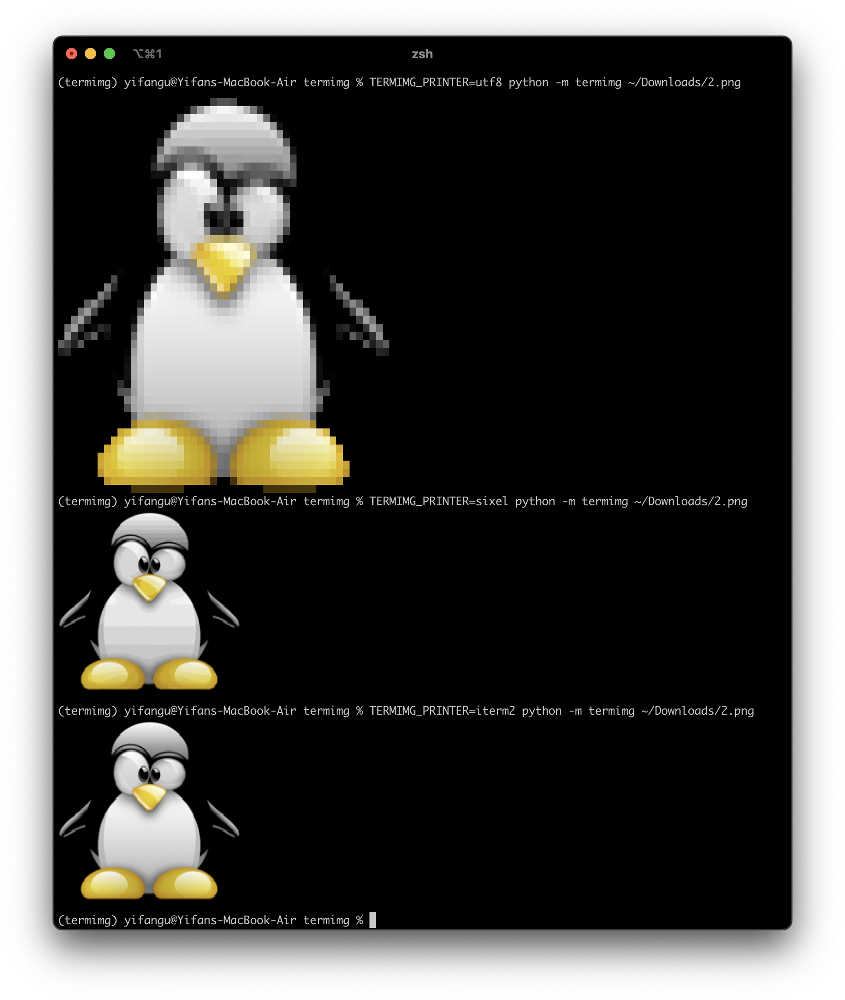

# termimg: a Terminal image printer for python



# Installation

```bash
# python3 only
python -m pip install termimg
```

# Usage

## Terminal

```bash
python -m termimg image.png # automatically detect what your terminal supports
python -m termimg --printer iterm2 image.png # use the iTerm2 printer
python -m termimg --printer sixel image.png # use the sixel printer
python -m terming --printer utf8 image.png # use the utf8 printer

# You can also use environment variables
TERMIMG_PRINTER=sixel python -m termimg image.png
```

## As a library

```python
import termimg
import PIL.Image

printer = termimg.get_printer() # or get_printer("sixel") to force a printer
image = PIL.Image.new("RGB", (16, 16))
printer.print(image)
```
